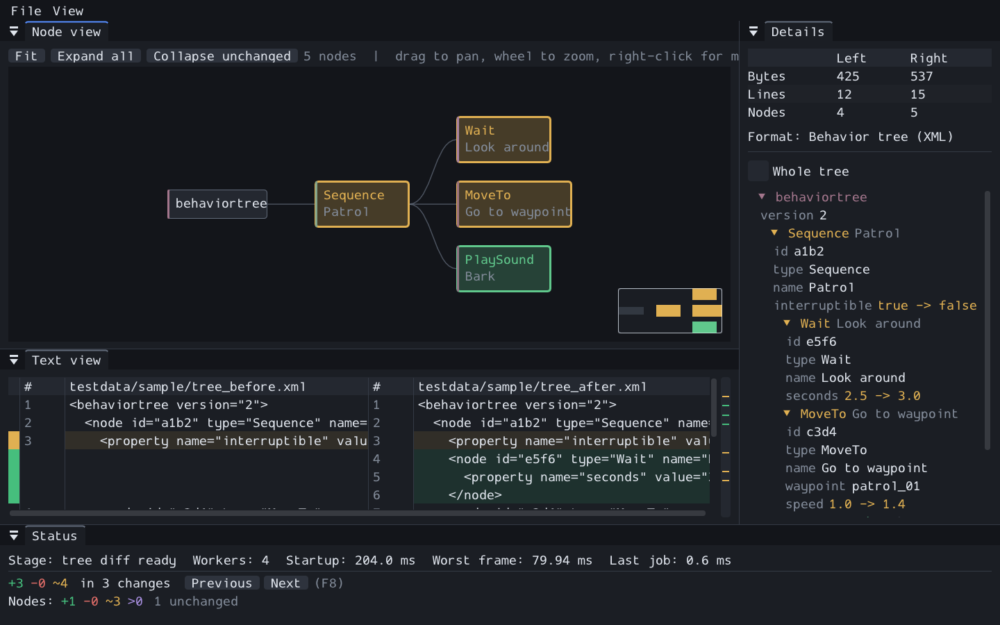
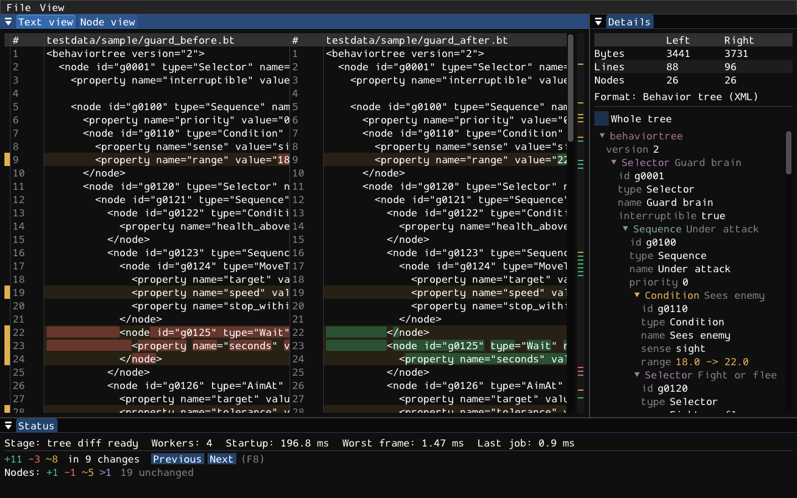
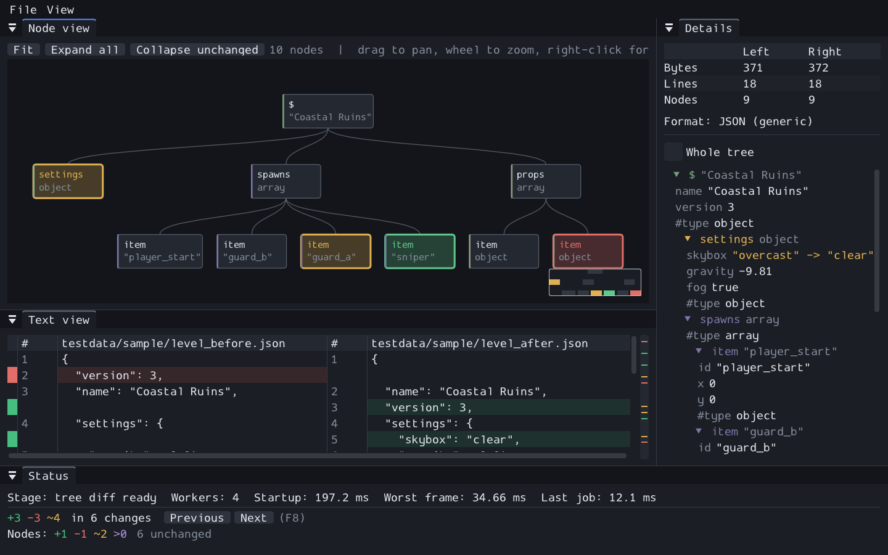

NM Tree Diff
============

[](https://github.com/nnen/nmtreediff/actions/workflows/ci.yml)

A lightweight GUI tool for diffing tree-shaped data. It shows the same diff two
ways, as text and as a node graph, and it runs from the command line so a
version control system can open it for the file types it understands. It is not
meant to replace your usual diff tool for everything else.

**[USAGE.md](USAGE.md) is the user guide.** Start there if you want to use the
tool rather than work on it.



The node view. A behaviour tree drawn left to right because the format asked
for it, each card coloured by what happened to the node, the text view of the
same pair below it, and the details panel saying what each property changed
from.



The text view of a larger pair, with the two views stacked as tabs. The same
comparison as lines, with the words that changed picked out inside a rewritten
line, and the node outline beside it.



A JSON level file. Objects are nodes, a list of scalars is one property rather
than a subtree of anonymous items, and members of an object are unordered while
items of an array are not.

Why
---

Line diffs are a poor fit for tree-shaped data. Moving a subtree in an XML file
reads as a large deletion next to a large insertion, and the one thing a
reviewer wants to know, that nothing inside it changed, is the thing a text
diff cannot say. This tool matches nodes between two documents first and
reports what actually happened to each one: added, deleted, modified, or moved.

What it does
------------

- **Two views of one diff.** A text view with a conventional line diff, and a
  node view drawing the tree as a graph coloured by change status. Switch
  between them at will; selection is shared, so a node in one view is the same
  node in the other.
- **Understands your formats.** Out of the box, XML elements are nodes and
  attributes are properties. JSON objects are nodes, and a list of scalars is
  one property with parts rather than a subtree of anonymous items, so a
  transform or a tag list reads as the one thing it is.
- **Keeps what it does not recognise.** An element a format has no rule for
  becomes a property rather than being passed over, so nothing in a file goes
  unreported. Beyond that, a format provider defines what counts as a node, which
  two nodes are the same node across versions, and how a node is titled and
  coloured.
- **Takes a format you write yourself, with no compiler.** A Lua script sits on
  top of XML or JSON and decides what the elements mean. The behaviour-tree
  format ships both ways, compiled and scripted, and the tests hold the two to
  the same answer.
- **Is configured by a script.** Extension mappings, the graph direction and the
  exit key come from a Lua file in your home directory or one you name on the
  command line. Ctrl+R reads the scripts again and rebuilds any format they
  define, so editing a script and reloading is the whole loop.
- **Says what happened.** An Output pane holds everything the program wrote,
  including the traceback of any error a script raised, because a window
  launched from the desktop opens no console and that text would otherwise
  exist nowhere.
- **Matches by identity, not just position.** When a format has stable
  identifiers, such as a GUID on a behavior tree node, two nodes with the same
  identifier are the same node however far apart they have moved. The sample
  behavior-tree provider does exactly that, and a node it has anchored survives
  even a change of type, which no structural heuristic could recover from.
- **Stays responsive.** Parsing, matching, and layout run off the frame loop,
  publish results in stages, and can be cancelled. A large file does not freeze
  the window.
- **Runs without a window.** A headless mode writes a text or JSON report and
  can set its exit status from the result, for scripts and build jobs.
- **Opens on its own.** Launch it with no arguments and choose both files in
  the window, or pass them on the command line the way a version control system
  does. The node graph runs top down or left to right, and a format may choose
  the direction that suits its own shape.

What it does not do yet
-----------------------

- The text view is side by side only. There is no unified view and no
  option to ignore formatting differences.
- There is no release to download and no installer. Build it from source.
- Nothing has been verified against a real Perforce or Git client yet.

Stack
-----

C++20 with Dear ImGui on GLFW and OpenGL 3.3, built with CMake. Dependencies
are fetched and pinned by exact git ref, so you need only CMake, a generator
and a compiler. pugixml for XML, simdjson for JSON, Catch2 for tests.

Building
--------

Needs CMake 3.25 or newer and a C++20 compiler. Dependencies are fetched and
pinned by the build, so nothing else has to be installed. On Windows the
Microsoft toolchain is the tested one; Clang needs version 19 or newer to
match the Microsoft standard library it compiles against.

```bash
cmake -S . -B build
```

```bash
cmake --build build --config RelWithDebInfo
```

Run the tests:

```bash
ctest --test-dir build -C RelWithDebInfo --output-on-failure
```

Build the API reference, which needs Doxygen on the path:

```bash
cmake --build build --target docs
```

Pack the executable, the licence, the user guide and the provider guide into a
zip archive under `build/package`:

```bash
cpack --config build/CPackConfig.cmake -C RelWithDebInfo -B build/package
```

Pushing a tag such as `v1.2.3`, matching the version in `CMakeLists.txt`,
makes the continuous integration publish that archive as a GitHub release.

Then compare two files:

```bash
build/bin/RelWithDebInfo/nmtreediff testdata/sample/tree_before.xml testdata/sample/tree_after.xml
```

[USAGE.md](USAGE.md) covers the rest: the two views, choosing a format, the
configuration file, and the headless reports.

Repository contents
-------------------

| File | What it is |
| --- | --- |
| [USAGE.md](USAGE.md) | The user guide. How to run the tool and what everything in it does. |
| [REQUIREMENTS.md](REQUIREMENTS.md) | What the tool has to do. The source of truth. |
| [CODE_GUIDELINES.md](CODE_GUIDELINES.md) | How the code is written: documentation, comments, constants and function length. |
| [IMPLEMENTATION_PLAN.md](IMPLEMENTATION_PLAN.md) | Architecture, data model, provider interface and matching algorithm, with the reasoning behind each choice. |
| [docs/PROVIDERS.md](docs/PROVIDERS.md) | How to teach the tool a format of your own. Carries the provider interface version, which is 2. |
| [docs/screenshots/](docs/screenshots/) | The screenshots above, taken with the tool's own `--screenshot` option from the sample pairs in `testdata/sample`. |
| [assets/icon/](assets/icon/) | The application icon, as Netpbm images and as the Windows icon that is embedded in the executable. |
| [tools/generate_icon.py](tools/generate_icon.py) | Draws the icon. Run it after changing the design to rewrite everything in `assets/icon/`; it needs only the Python standard library. |
| [Doxyfile](Doxyfile) | Configuration for the API reference. Undocumented code is an error, so the `docs` target fails rather than quietly producing a thinner reference. |
| [testdata/sample/providers.lua](testdata/sample/providers.lua) | A sample configuration script. |
| [testdata/sample/behaviortree.lua](testdata/sample/behaviortree.lua) | The behaviour-tree format written in script rather than compiled in. |
| [testdata/sample/sentry_before.bt](testdata/sample/sentry_before.bt) | A behaviour tree with decorator chains, which the node view draws stacked. Compare it with `sentry_after.bt`. |
| [testdata/golden/](testdata/golden/) | The corpus of comparisons whose expected output the tests check against. |

Licence
-------

MIT.
